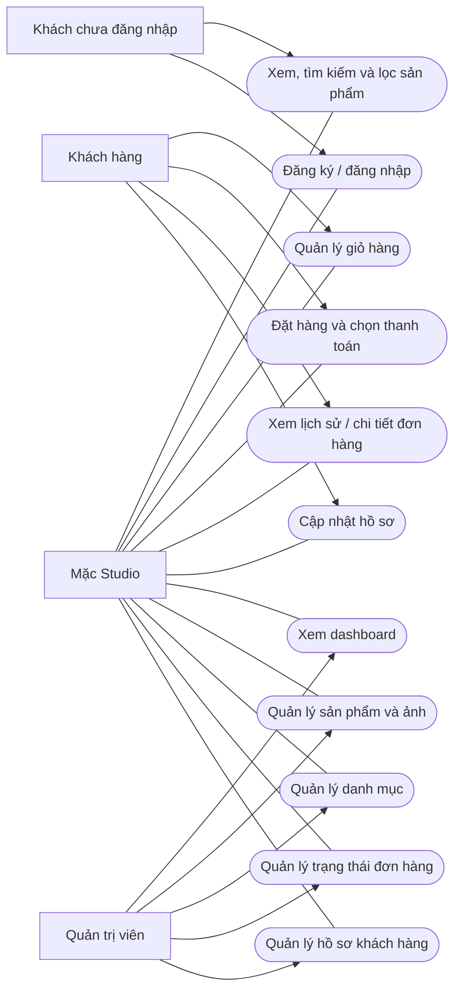

# Sơ đồ use case

```mermaid
flowchart LR
    Guest["Khách chưa đăng nhập"]
    Customer["Khách hàng"]
    Admin["Quản trị viên"]
    Store["Mặc Studio"]

    Guest --> U1(["Xem, tìm kiếm và lọc sản phẩm"])
    Guest --> U2(["Đăng ký / đăng nhập"])
    Customer --> U3(["Quản lý giỏ hàng"])
    Customer --> U4(["Đặt hàng và chọn thanh toán"])
    Customer --> U5(["Xem lịch sử / chi tiết đơn hàng"])
    Customer --> U6(["Cập nhật hồ sơ"])
    Admin --> U7(["Xem dashboard"])
    Admin --> U8(["Quản lý sản phẩm và ảnh"])
    Admin --> U9(["Quản lý danh mục"])
    Admin --> U10(["Quản lý trạng thái đơn hàng"])
    Admin --> U11(["Quản lý hồ sơ khách hàng"])
    Store --- U1
    Store --- U2
    Store --- U3
    Store --- U4
    Store --- U5
    Store --- U6
    Store --- U7
    Store --- U8
    Store --- U9
    Store --- U10
    Store --- U11
```

**Quyền truy cập:** duyệt catalog công khai; checkout và trang đơn hàng yêu cầu role `CUSTOMER`; các route `/admin/**` yêu cầu role `ADMIN`.
