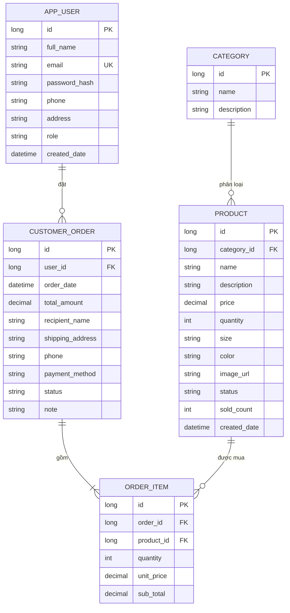

# Sơ đồ thực thể - quan hệ

```mermaid
erDiagram
    APP_USER {
        long id PK
        string full_name
        string email UK
        string password_hash
        string phone
        string address
        string role
        datetime created_date
    }
    CATEGORY {
        long id PK
        string name
        string description
    }
    PRODUCT {
        long id PK
        long category_id FK
        string name
        string description
        decimal price
        int quantity
        string size
        string color
        string image_url
        string status
        int sold_count
        datetime created_date
    }
    CUSTOMER_ORDER {
        long id PK
        long user_id FK
        datetime order_date
        decimal total_amount
        string recipient_name
        string shipping_address
        string phone
        string payment_method
        string status
        string note
    }
    ORDER_ITEM {
        long id PK
        long order_id FK
        long product_id FK
        int quantity
        decimal unit_price
        decimal sub_total
    }

    CATEGORY ||--o{ PRODUCT : "phân loại"
    APP_USER ||--o{ CUSTOMER_ORDER : "đặt"
    CUSTOMER_ORDER ||--|{ ORDER_ITEM : "gồm"
    PRODUCT ||--o{ ORDER_ITEM : "được mua"
```

`ORDER_ITEM.unit_price` là snapshot giá tại thời điểm đặt hàng; thay đổi giá catalog không làm thay đổi lịch sử đơn.
